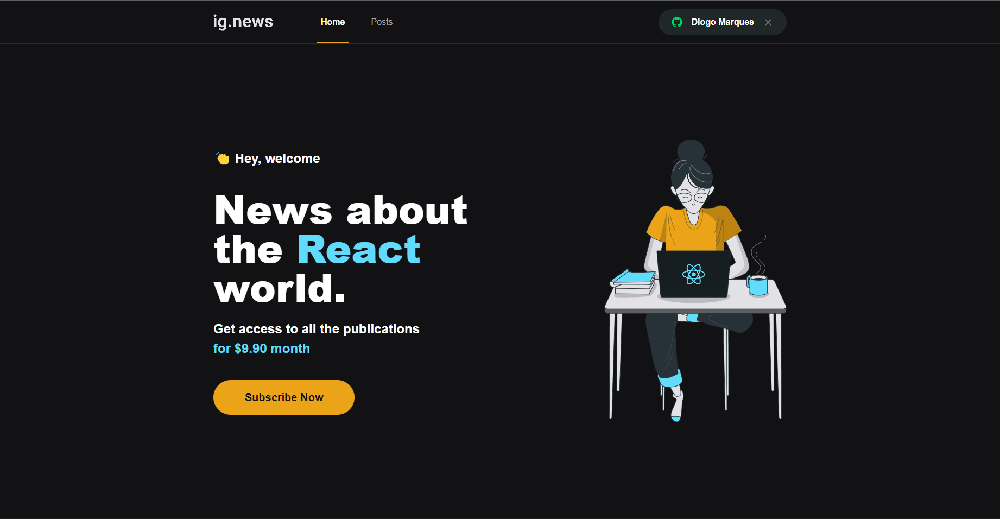

<p align="center">
   
</p>

<h1 align="center">Ignews</h1>

<h3 align="center">
  :rocket: Projeto desevolvido durante o curso Ignite, disponibilizado pela RocketSeat. 🚀
</h3>

<p align="center">
  

  <a href="https://rocketseat.com.br">
    
  </a>

  
</p>

# :computer: Tecnologias

Este projeto foi feito utilizando as seguintes tecnologias:

- [React](https://reactjs.org/)
- [Typescript](https://www.typescriptlang.org/)
- [NextJS](https://nextjs.org/)
- [Stripe](https://stripe.com/br)
- [FaunaDB](https://fauna.com/)
- [Prismic CMS](https://prismic.io/)


## Como Iniciar?

1.  **Faça o clone do repositório.**

```
git clone https://github.com/DiogoAMV/ignews.git
```

2.  **Instalação das dependências**

   execute na pasta do projeto o seguinte comando:

```
npm install ou yarn
 ```

   após a instalação execute o seguinte comando.

```
npm run dev ou yarn dev
```

3.  **Verificando no navegador**

    O projeto vai executar no seguinte endereço: `http://localhost:3000`


## :memo: Licença

Esse projeto está sob a licença MIT. Veja o arquivo [LICENSE](LICENSE.md) para mais detalhes.
